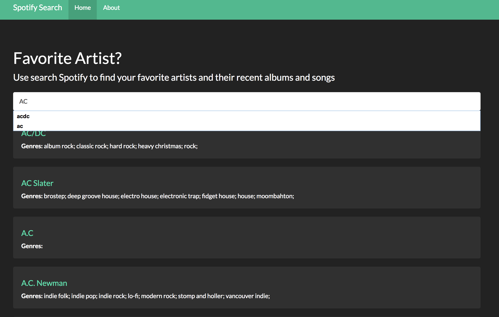
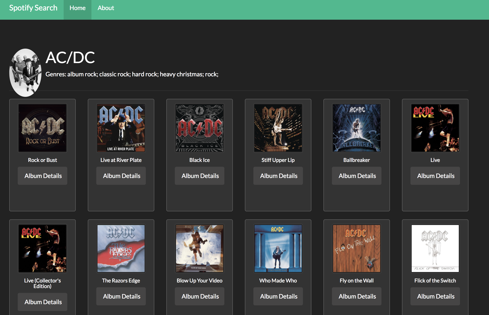
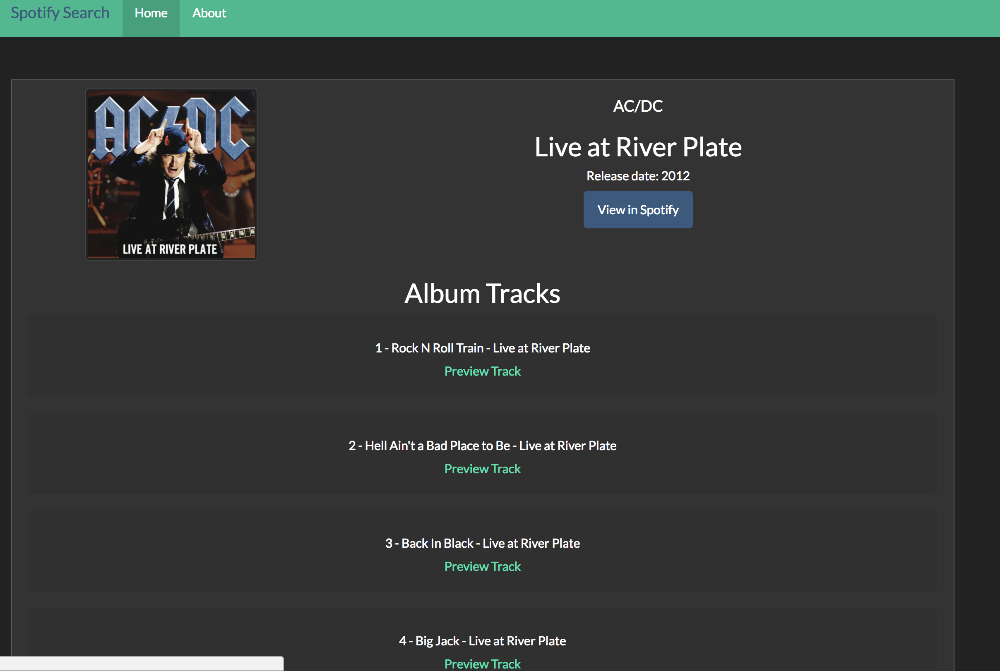
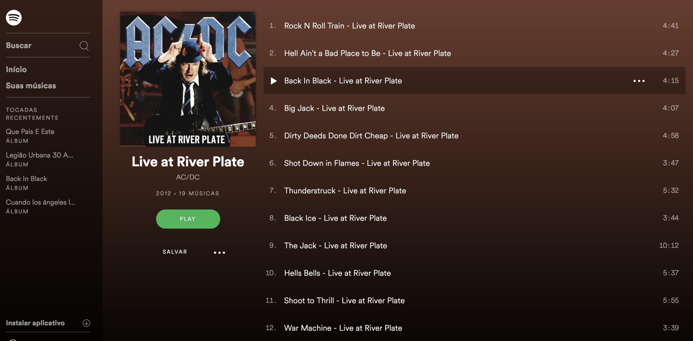

# Search Spotify

Simple tutorial that creates a functional spotify search front end using entirelly Angular 5. Uses and connect to Spotify Rest API's for search and listing, into custom Angular web pages; artist, their albums and a page that shows selected albums details (see screenshots below). It is integrated with Spotify, so preview of albums and song can be played directly in Spotify. It uses routing mechanism in Angular for moving/showing on diferent views. As spotify API requires authentication is is necessary to register the application into Spotify Dev and then get an authorization token which is used in every API calls. Kweywords: Angular 5, Spotify Dev API's, Rest API, Single Page App, Boostrap, Routing, Authetication API's.

## Development server

Run `ng serve` for a dev server. Navigate to `http://localhost:4200/`. The app will automatically reload if you change any of the source files.

### Artist Search Page

### Artist Albums Page

### Albuns Page

### Albuns page in Spotify (When albuns details are clicked)

